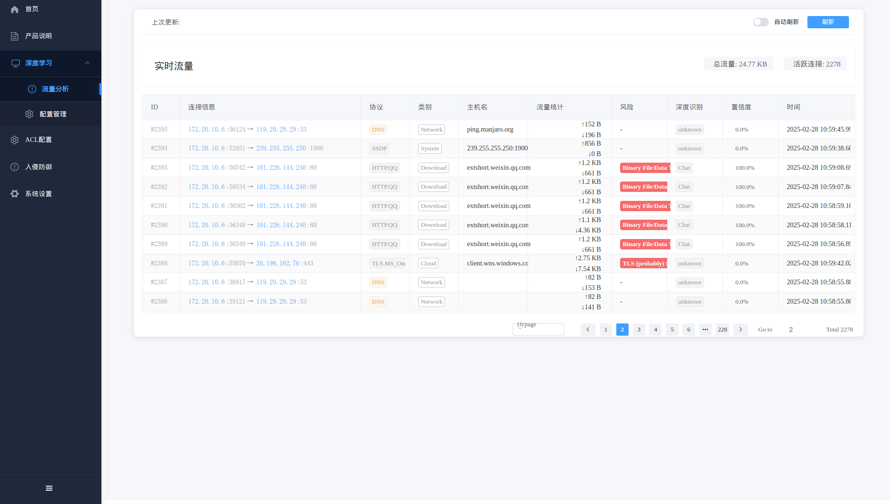

# FlowSeek

--------------------------------------------------------------------------------
[**FlowSeek**][repo] is a multiplatform c/c++ framework providing fast, flexible, and expressive data structures designed to make
working with **online** or **offline** network data easy and intuitive. It aims to be c/c++'s fundamental high-level
building block for doing practical, **real-world** network flow data analysis. Additionally, it has the broader
goal of becoming **a unifying network data analytics framework for researchers** providing data reproducibility
across experiments.


## Main Features

* **Performance:** FlowSeek is designed to be fast: [**AF_PACKET_V3/FANOUT**][packet] on Linux, multiprocessing, native
  [**CFFI based**][cffi] computation engine.
* **Encrypted layer-7 visibility:** FlowSeek deep packet inspection is based on [**nDPI**][ndpi].
  It allows FlowSeek to perform [**reliable**][reliable] encrypted applications identification and metadata
  fingerprinting (e.g. TLS, SSH, DHCP, HTTP).
* **System visibility:** FlowSeek probes the monitored system's kernel to obtain information on open Internet sockets
  and collects guaranteed ground-truth (process name, PID, etc.) at the application level.
* **Deep Learning oriented:** FlowSeek aims to make Deep Learning Approaches for network traffic management
reproducible and deployable. By using FlowSeek as a common framework, researchers ensure that models are trained using
the same feature computation logic, and thus, a fair comparison is possible. Moreover, trained models can be deployed
and evaluated on live networks using [**NFPlugins**][nfplugin].


## How to get it?

Binary installers for the latest released version are available.

```bash
wget https://github.com/flowseek/flowseek/releases/latest/download/flowseek.tar.gz
```

> **Windows Notes**: FlowSeek does not include capture drivers on Windows (license restrictions). It is required to
> install [Npcap drivers][npcap] before installing FlowSeek.
> If Wireshark is already installed on Windows, then Npcap drivers are already installed, and you do not need to perform
> any additional action.


## How to use it?

### Encrypted application identification and metadata extraction

Dealing with a big pcap file and want to aggregate into labeled network flows? **Flowseek** make this path easier in
a few lines:

```bash
tar -xvf flowseek.tar.gz
cd x86_64-pc-linux-gnu-flowseek
sudo ./x86_64-pc-linux-gnu-flowseek -i wlan0
```

Open the browser http://localhost:3000.




### System visibility

FlowSeek probes the monitored system's kernel to obtain information on open Internet sockets and collects guaranteed
ground-truth (process name, PID, etc.) at the application level.

```bash

```


### Post-mortem statistical flow features extraction

FlowSeek performs 48 post-mortem flow statistical features extraction, which includes detailed TCP flags analysis,
minimum, mean, maximum, and standard deviation of both packet size and inter-arrival time in each direction.

```python

```


### Early statistical flow features extraction

FlowSeek performs early (up to 255 packets) flow statistical features extraction (referred to as SPLT analysis in the
literature). It is summarized as a sequence of these packets' directions, sizes, and inter-arrival times.

```python

```

### Pandas export interface

FlowSeek natively supports Pandas as an export interface.

```python

```


### CSV export interface

FlowSeek natively supports CSV file format as an export interface.

```python

```


### Machine Learning models training and deployment

The following simplistic example demonstrates how to train and deploy a machine-learning approach for traffic
flow categorization.
We want to run a classification of Social Network category flows based on bidirectional_packets and bidirectional_bytes
as input features. For the sake of brevity, we decide to predict only at the flow expiration stage.

#### Training the model

```bash
python ./1_Png2Mnist.py --train ./Train
python ./2_encrypt_traffic_cnn_1d_tf2.py ./Mnist 2 3000
...
Classification Report:
              precision    recall  f1-score   support

     Vpn_P2p       0.89      0.78      0.83        40
    Vpn_Voip       0.97      0.99      0.98       285

    accuracy                           0.96       325
   macro avg       0.93      0.88      0.90       325
weighted avg       0.96      0.96      0.96       325
```

#### Predict by model

```bash
python ./3_encrypt_traffic_cnn_1d_tf2_png.py Train/0/vpn_bittorrent.pcap.TCP_10-8-8-130_33781_207-241-227-212_80.png 2  ./model_2class_Mnist/model.h5
...
Loading existing model...
 Total params: 5,822,340 (22.21 MB)
 Trainable params: 5,822,338 (22.21 MB)
 Non-trainable params: 0 (0.00 B)
 Optimizer params: 2 (12.00 B)
1/1 ━━━━━━━━━━━━━━━━━━━━ 0s 72ms/step
Predicted Label: Vpn_P2p
```


## Building from sources

Git submodule synchronization and compilation，only when first build.
```bash
chmod +x ./build.sh
./build.sh check
./build.sh lib
```

flowseek make

```bash
./build.sh make
```

flowseek clean

```bash
./build.sh clean
```


## Contributing

Please read [**Contributing**][contribute] for details on our code of conduct and the process for submitting pull
requests to us.


## Ethics

**FlowSeek** is intended for network data research and forensics. Researchers and network data scientists can use this
framework to build reliable datasets and train and evaluate network-applied machine learning models.
As with any packet monitoring tool, **FlowSeek** could be misused. **Do not run it on any network that you do not own or
administrate**.


## Credits

### Authors

The following people contributed to FlowSeek:

* [**阿威**](mailto:missazuozhu@gmail.com): Creator and core developer.

  

### Supporting organizations

The following organizations supported FlowSeek:

* [**ntop**](https://www.ntop.org/): Technical support of [**nDPI**][ndpi] integration.
* [**The Nmap Project**](https://nmap.org): Technical support of [**Npcap**][npcap] integration (NPCAP OEM installer on Windows CI).


## Publications that use FlowSeek

* [**A Hierarchical Architecture and Probabilistic Strategy for Collaborative Intrusion Detectionn**](https://ieeexplore.ieee.org/abstract/document/9705027)
* [**Open-Source Framework for Encrypted Internet and Malicious Traffic Classification**](https://arxiv.org/pdf/2206.10144.pdf)
* [**ConFlow: Contrast Network Flow Improving Class-Imbalanced Learning in Network Intrusion Detection**](https://www.researchsquare.com/article/rs-1572776/latest.pdf)
* [**Continual Learning for Anomaly based Network Intrusion Detection**](https://ieeexplore.ieee.org/abstract/document/9668482)
* [**A self-secure system based on software-defined network**](https://www.spiedigitallibrary.org/conference-proceedings-of-spie/12250/122500Z/A-self-secure-system-based-on-software-defined-network/10.1117/12.2639591.short?SSO=1)
* [**Robust Variational Autoencoders and Normalizing Flows for Unsupervised Network Anomaly Detection**](https://hal.archives-ouvertes.fr/hal-03542451/document)
* [**RADON: Robust Autoencoder for Unsupervised Anomaly Detection**](https://ieeexplore.ieee.org/document/9699174)
* [**A Generic Machine Learning Approach for IoT Device Identification**](https://ieeexplore.ieee.org/document/9702983)
* [**Ranking Network Devices for Alarm Prioritisation: Intrusion Detection Case Study**](https://ieeexplore.ieee.org/abstract/document/9559086)
* [**Network Flows-Based Malware Detection Using A Combined Approach of Crawling And Deep Learning**](https://ieeexplore.ieee.org/document/9500920)
* [**Network Intrusion Detection Based on Distributed Trustworthy Artificial Intelligence**](https://repository.dl.itc.u-tokyo.ac.jp/record/2002253/files/48196454.pdf)
* [**Generative Transformer Framework For Network Traffic Generation And Classification**](https://cyberleninka.ru/article/n/generative-transformer-framework-for-network-traffic-generation-and-classification)
* [**Multi-Class Network Traffic Generators and Classifiers Based on Neural Networks**](https://ieeexplore.ieee.org/document/9416067)
* [**Using Embedded Feature Selection and CNN for Classification on CCD-INID-V1 A New IoT Dataset**](https://www.mdpi.com/1424-8220/21/14/4834)
* [**An Approach Based on Knowledge-Defined Networking for Identifying Video Streaming Flows in 5G Networks**](https://latamt.ieeer9.org/index.php/transactions/article/view/5083/1116)
* [**Knowledge Discovery: Can It Shed New Light on Threshold Definition for Heavy‑Hitter Detection?**](https://link.springer.com/content/pdf/10.1007/s10922-021-09593-w.pdf)
* [**Collecting and analyzing Tor exit node traffic**](https://www.diva-portal.org/smash/get/diva2:1575255/FULLTEXT01.pdf)
* [**Analysis and Collection Data from IP Network**](https://sciendo.com/article/10.2478/aei-2022-0013)


## License

This project is licensed under the LGPLv3 License - see the [**License**][license] file for details

[license]: https://github.com/FlowSeek/FlowSeek/blob/master/LICENSE
[contribute]: https://FlowSeek.org/docs/community
[documentation]: https://FlowSeek.org/
[ndpi]: https://github.com/ntop/nDPI
[npcap]: https://npcap.org
[nfplugin]: https://FlowSeek.org/docs/api#nfplugin
[reliable]: http://people.ac.upc.edu/pbarlet/papers/ground-truth.pam2014.pdf
[repo]: https://github.com/flowseek/flowseek/
[demo]: https://mybinder.org/v2/gh/FlowSeek/FlowSeek/master?filepath=demo_notebook.ipynb
[pypy]: https://www.pypy.org/
[cffi]: https://cffi.readthedocs.io/en/latest/goals.html
[sah]:https://raw.githubusercontent.com/FlowSeek/FlowSeek/master/assets/sah_logo.png?raw=true
[tuke]:https://raw.githubusercontent.com/FlowSeek/FlowSeek/master/assets/tuke_logo.png?raw=true
[ntop]:https://raw.githubusercontent.com/FlowSeek/FlowSeek/master/assets/ntop_logo.png?raw=true
[nmap]:https://raw.githubusercontent.com/FlowSeek/FlowSeek/master/assets/nmap_logo.png?raw=true
[google]:https://raw.githubusercontent.com/FlowSeek/FlowSeek/master/assets/google_logo.png?raw=true
[l]:https://github.com/ryanoasis/nerd-fonts/wiki/screenshots/v1.0.x/linux-pass-sm.png
[m]:https://github.com/ryanoasis/nerd-fonts/wiki/screenshots/v1.0.x/mac-pass-sm.png
[w]:https://github.com/ryanoasis/nerd-fonts/wiki/screenshots/v1.0.x/windows-pass-sm.png
[install]: https://www.FlowSeek.org/docs/#building-FlowSeek-from-sources
[doi]: https://doi.org/10.1016/j.comnet.2021.108719
[comnet]: https://www.sciencedirect.com/journal/computer-networks/vol/204/suppl/C
[packet]: https://manned.org/packet.7

